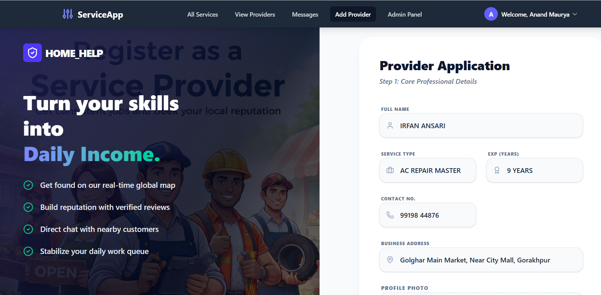
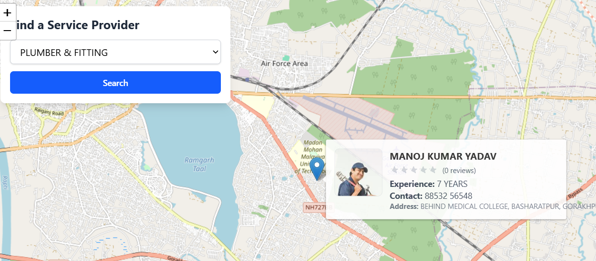
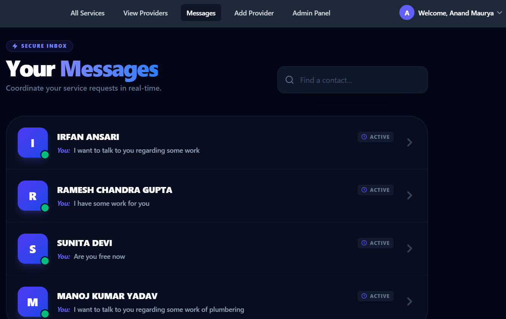
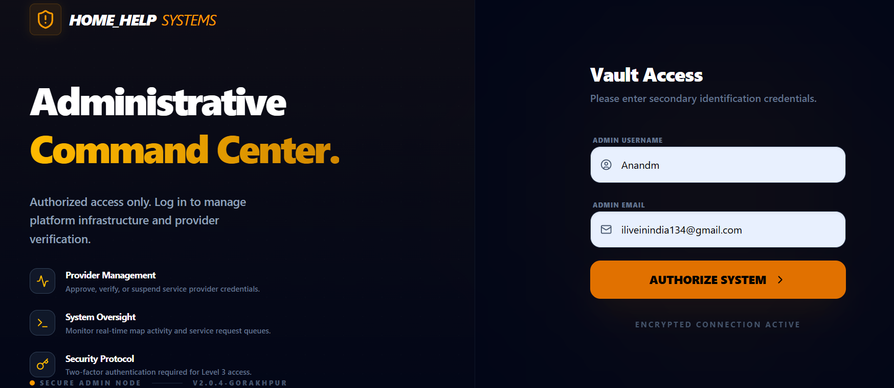
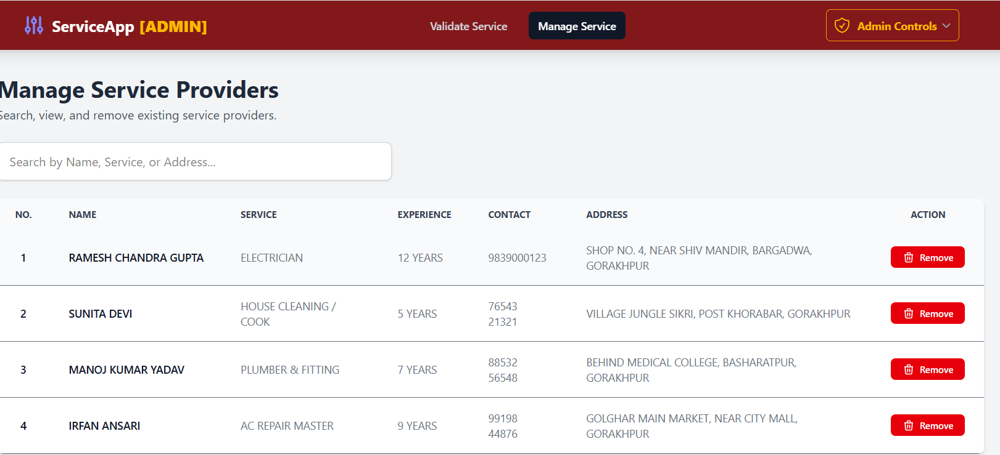
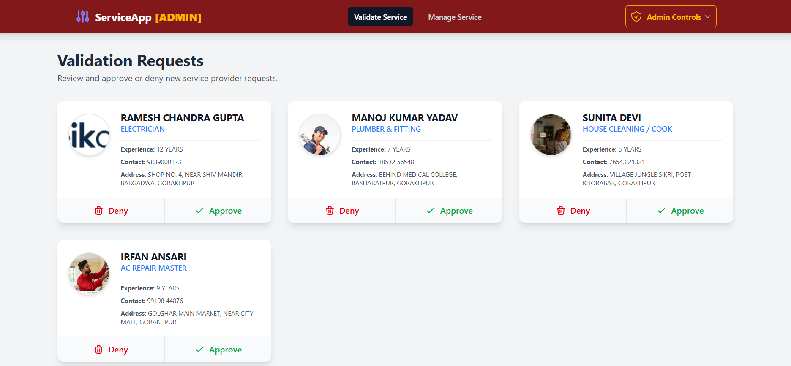
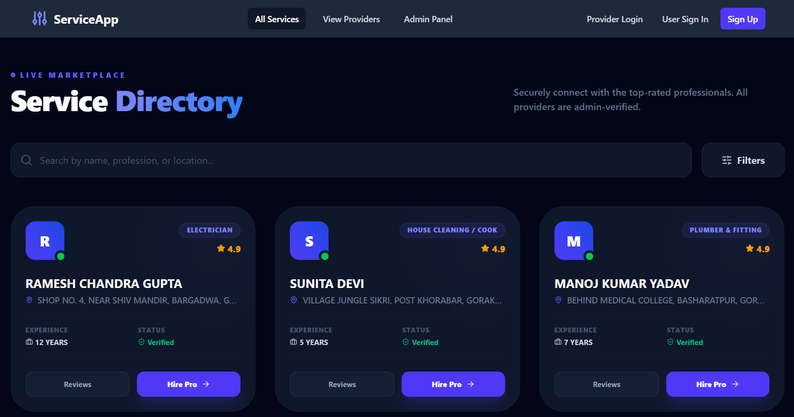
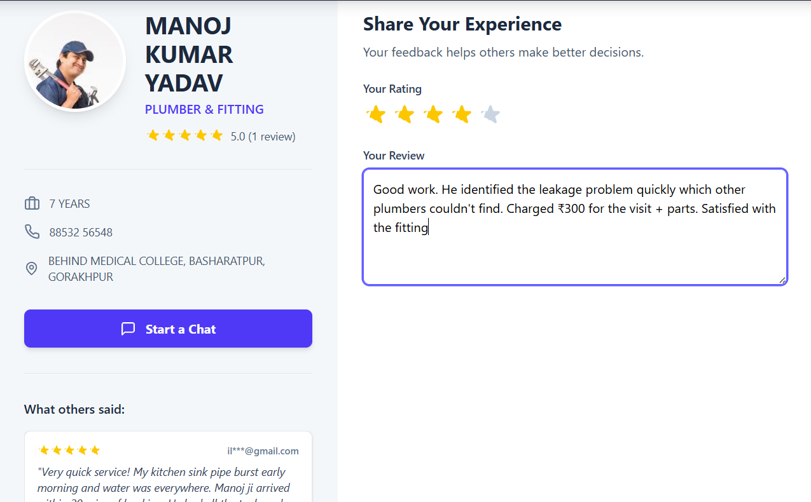

# 🏠 Home_Help – Local Service Provider Platform

Home_Help is a full-stack web application designed to bridge the gap between **daily service providers**
(carpenters, plumbers, electricians, teachers, etc.) and users seeking **verified services nearby**.

The platform focuses on **trust, real-time location awareness, and secure communication**, helping
daily-wage workers gain visibility while enabling users to find reliable professionals easily.

---

## 🌐 Home Page

  

---

## 🚀 Features

### 👤 Service Provider Module
- Secure registration with profile details
- Profession, experience & contact information
- Admin verification before going live

  

---

### 📍 Location-Based Discovery
- Real-time map integration
- Find nearby verified service providers
- Accurate geo-based matching

  

---

### 💬 Real-Time Chat System
- One-to-one chat between users and providers
- Message history & delete functionality
- Smooth and responsive UI

  
  
  

---

### 🛡️ Authentication & Security
- JWT-based authentication
- Email verification system
- Role-based access (User / Provider / Admin)

  

---

### 🧑‍💼 Admin Panel
- Secure admin login
- Verify & approve service providers
- Manage users and platform data

  
  
  

---

### ⭐ Reviews & Providers Listing
- View all service providers
- User feedback & ratings

  
  

## 🛠️ Tech Stack

### Frontend
- React.js
- HTML, CSS, JavaScript
- Tailwind CSS

### Backend
- Node.js
- Express.js
- JWT Authentication

### Database
- MongoDB

### Tools & APIs
- Maps API
- REST APIs
- Git & GitHub

---

## 📌 Conclusion
Home_Help empowers local service providers with visibility while giving users a **trusted, secure,
and location-aware platform** to find daily services effortlessly.
